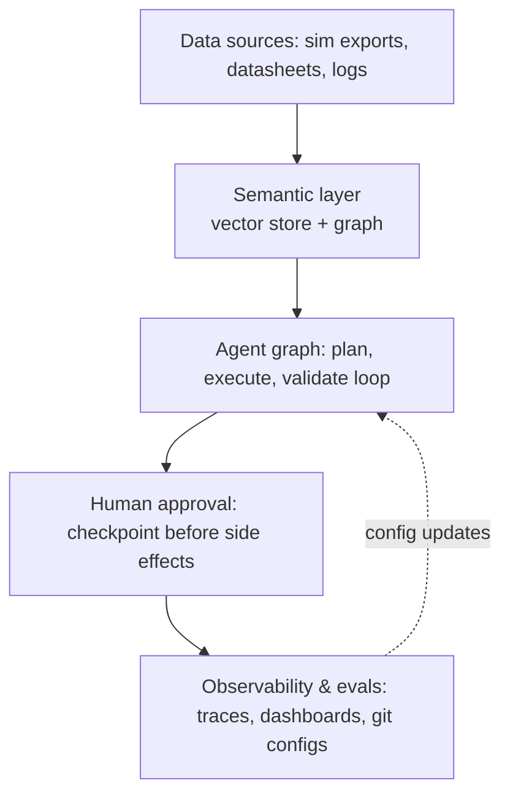

# Agentic_platform

Agentic platform <i>proof of concept</i> - **WORK IN PROGRESS**.  
(each `em-dash` was manually approved by the author :)

## Hardware

| Component | Spec
|-----------|-
| CPU  | 11th Gen Intel Core i7-11700K @ 3.60GHz
| Memory | 64GiB (4×16GiB DDR4, 2667 MHz)
| Disk | 1TB NVMe + 2TB SSD
| GPU  | NVIDIA GeForce RTX 3080, 10GB VRAM
| PCIe | 4.0 over a x16 lane width (16GT/s)

The 10GB 3080 is a real constraint but it pushes toward the *engineering* of the platform
(orchestration, observability, data plumbing) rather than trying to prove out model
quality and chasing benchmark scores. With 10GB VRAM, quantized 7-8B models (Llama 3.1
8B, Qwen2.5 7B, Mistral 7B) run comfortably via Ollama at Q4/Q5.



## What's built

1. **Data sources** — Public demo/test data:
   - Semiconductor packaging datasheets: [TI sdls047](https://www.ti.com/lit/ds/sdls047/sdls047.pdf)
     (package outline, mechanical dimensions, thermal characteristics)
   - JEDEC spec: [J-STD-033](https://www.jedec.org/standards-documents/docs/j-std-033c)
     (Moisture/Reflow Sensitive Surface-Mount Devices, free after registration)
   - Synthetic thermal simulation output: [HotSpot](https://github.com/uvahotspot/HotSpot)
     `/examples` floorplans, power traces, and configs, used directly as synthetic data

   The two licensed PDFs aren't redistributed in this repo — see `data/download_note.md`
   for where to get them; they're referenced locally via symlink.

2. **Semantic layer** — `scripts/ingest_pdfs.py` chunks the PDFs (`pdfplumber`), embeds
   each chunk with `nomic-embed-text` via Ollama, and upserts into a persistent Chroma
   collection (`chroma_db/`, gitignored — regenerate locally). `scripts/ingest_graph.py`
   parses the HotSpot floorplan/materials/config/power-trace files into a part → material
   → simulation-run graph and writes it to a **Neo4j Aura Free** instance via `MERGE`
   (idempotent full rebuild on every run, no local graph file). `agent/graph_db.py` holds
   the one shared driver, credentialed from `.env`'s `NEO4J_URI`/`NEO4J_USER`/
   `NEO4J_PASSWORD` — the Aura instance itself isn't provisioned by anything in this repo;
   see Setup below.

3. **Agent graph** — A LangGraph `StateGraph` (`agent/graph.py`) running
   `qwen2.5:7b-instruct-q4_K_M` through Ollama's OpenAI-compatible endpoint, with
   explicit `TypedDict` state and real conditional routing: a failed validation retries
   the executor (feeding back what failed) up to a configurable limit, then rolls back
   to a terminal failed state. The validator is deterministic — it checks for the unit
   name, material, and a cited source in the draft, not an LLM judgment call. Model
   name, retry limit, retrieval parameters, and both prompt templates are externalized
   in `agent/config.yaml` and loaded by `agent/config.py` — no hardcoded values in the
   graph itself.
   **Known limitation:** the planner produces a real LLM-written plan, but the executor
   doesn't yet branch on its contents — it runs a fixed tool sequence regardless of what
   the plan says. Making the executor parse and act on the plan is the next fix.

4. **Human approval** — A LangGraph interrupt node pauses the graph after a validated
   draft and waits for an explicit CLI y/n before the one write action (saving a report
   to `reports/`, gitignored) can happen.

5. **Configuration & observability** — A self-hosted Langfuse stack
   (`langfuse/docker-compose.yml`) captures every LLM call and tool invocation
   (`@observe` on each tool in `agent/tools.py`, a shared `CallbackHandler` on both LLM
   calls in `agent/graph.py`) as a single trace per run, flushed at the end of
   `agent/run.py`. A GitHub Actions workflow (`.github/workflows/eval.yml`) runs a
   deterministic pytest suite (`evals/test_regression.py`) on every push — peak-power
   extraction, graph lookups, validator logic, all three routing branches, and report
   writing, with no live model or external service required.

**Time budget note:** model quality is the weakest link no matter what, given the
hardware — time went into control flow, data plumbing, and config/observability
structure instead of prompt tuning.

## Setup

Built and run on Python 3.12.3.

```bash
git clone https://github.com/npwa/Agentic_platform.git
cd Agentic_platform
python3 -m venv .venv
source .venv/bin/activate
pip install -r requirements.txt

# pull the local models
ollama pull qwen2.5:7b-instruct-q4_K_M
ollama pull nomic-embed-text

# copy and fill in secrets (generate your own — don't reuse the examples)
cp .env.example .env
cp langfuse/.env.example langfuse/.env

# bring up the self-hosted Langfuse stack
cd langfuse && docker compose up -d && cd ..
# the stack auto-provisions a project from langfuse/.env's LANGFUSE_INIT_* values;
# make sure the PUBLIC/SECRET key pair in the root .env matches that project

# Neo4j Aura Free must already exist before ingestion/the agent can run --
# unlike Langfuse this isn't self-hosted by anything here. Create a free
# instance at https://console.neo4j.io, then put its connection details in
# the root .env as NEO4J_URI (neo4j+s://...), NEO4J_USER, NEO4J_PASSWORD.

# get the licensed PDFs per data/download_note.md, then:
python scripts/ingest_pdfs.py
python scripts/ingest_graph.py  # populates the Neo4j Aura instance above

# run the agent graph end to end (traces to Langfuse at http://localhost:3000)
python -m agent.run

# run the regression suite locally (also runs in CI on every push)
pytest evals/ -v
```

## Roadmap

- Executor branches on the planner's actual plan, instead of a fixed tool sequence
- Multi-agent coordination
- Production CI/CD for agent configs beyond the current regression gate (prompt/version
  rollout, not just correctness checks)
- Enterprise integration patterns (RBAC/ABAC)

<i>...to be continued</i>
