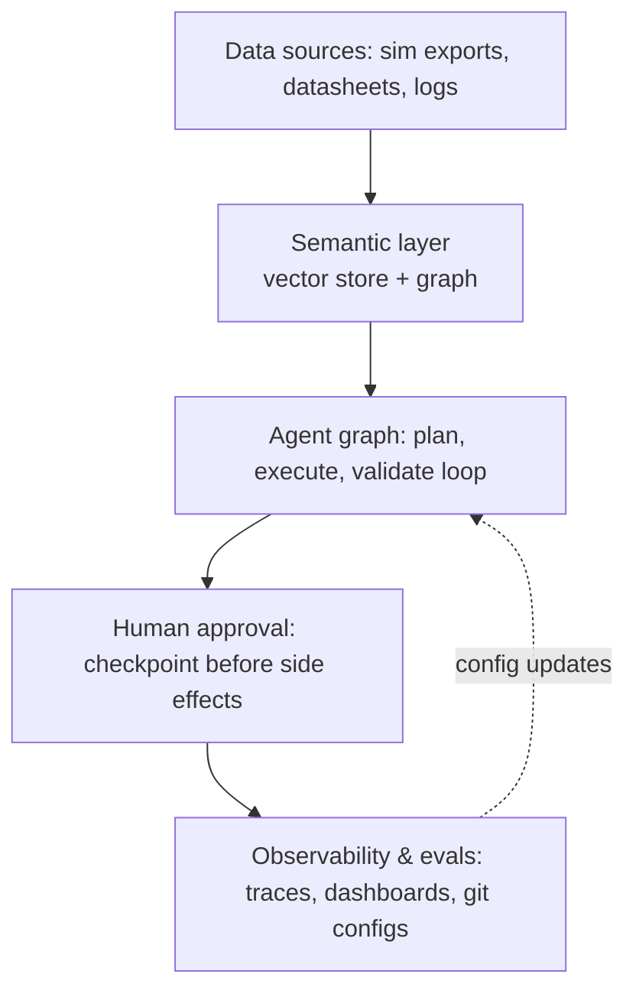

# Agentic_platform

Agentic platform <i>proof of concept</i> - **WORK IN PROGRESS**.  
(each `em-dash` was manually approved by the author :)

## Hardware

| Component | Spec
|-----------|-
| CPU  | 11th Gen Intel Core i7-11700K @ 3.60GHz
| Memory | 64GiB (4×16GiB DDR4, 2667 MHz)
| Disk | 1TB NVMe + 2TB SSD
| GPU  | NVIDIA GeForce RTX 3080, 10GB VRAM
| PCIe | 4.0 over a x16 lane width (16GT/s)

The 10GB 3080 is a real constraint but it pushes toward the *engineering* of the platform
(orchestration, observability, data plumbing) rather than trying to prove out model
quality and chasing benchmark scores.

**What the hardware supports:** with 10GB VRAM, quantized 7–8B models (Llama 3.1 8B,
Qwen2.5 7B, Mistral 7B) run comfortably via Ollama at Q4/Q5. A 14B model could work with
aggressive quantization.

Here's the draft architecture:

1. **Data sources, use public demo/test data**
   Publicly accessible links that match the requirements for this POC:
   - Semiconductor packaging datasheets
     https://www.ti.com/lit/ds/sdls047/sdls047.pdf  
     (Texas Instruments product datasheet containing package outline, mechanical
     dimensions, and thermal characteristics)
   - JEDEC specs
     https://www.jedec.org/standards-documents/docs/j-std-033c  
     (J-STD-033 – Joint IPC/JEDEC Standard for Handling, Packing, Shipping, and Use of
     Moisture/Reflow Sensitive Surface-Mount Devices. Free download after registration)
   - Synthetic thermo-mechanical / thermal simulation output
     https://github.com/uvahotspot/HotSpot  
     (Official HotSpot thermal simulator repository. The /examples directory contains
     floorplans, power traces, configuration files, and generated steady-state / transient
     thermal simulation outputs that you can use directly as synthetic data)

2. **Semantic layer** — Chroma or Qdrant (both run fine locally, low VRAM footprint since
   embeddings can run on CPU or a small embedding model like `nomic-embed-text` via
   Ollama) for the vector side. A lightweight `networkx` graph for structured
   relationships (part → material → simulation run) is enough to demonstrate
   "knowledge-graph-backed" without standing up Neo4j.

3. **Agent graph** — This is the centerpiece. I will use **LangGraph** (talks to Ollama
   through its OpenAI-compatible endpoint) to build an explicit planner → executor →
   validator graph with real state, branching, and a retry/rollback edge. This is what
   separates "agent demo" from "agentic platform engineering". I'll keep the model small
   (8B) and the *tasks* simple (e.g., "given this sim data, identify the layer with peak
   stress and draft a summary") — the graph structure is what you're demonstrating, not
   reasoning depth.

4. **Human approval** — A LangGraph interrupt node that pauses before any "write" action
   (e.g., before the agent would file a report or modify data) and waits for a
   CLI/Streamlit confirmation. Trivial to build, but it directly answers
   "human-in-the-loop controls with clear autonomy boundaries" from the preferred
   qualifications.

5. **Observability & evals** — Self-host **Langfuse** (docker-compose, runs fine locally)
   to capture traces, tool calls, latency, and token cost per run. Version your
   prompts/tool configs as YAML in git, and wire a small GitHub Action that runs a handful
   of eval cases on push (even a naive "did the validator pass" check counts as a
   regression gate).

**I'm on a limited time budget:** the model quality will be the weakest part of this demo
no matter what — I won't over-invest in prompt tuning. Instead, I'll spend time on the
graph's explicit state/control flow, the trace/eval dashboard, and the git-versioned
config.

----

## Setup (coming soon)

<i>...to be continued</i>
