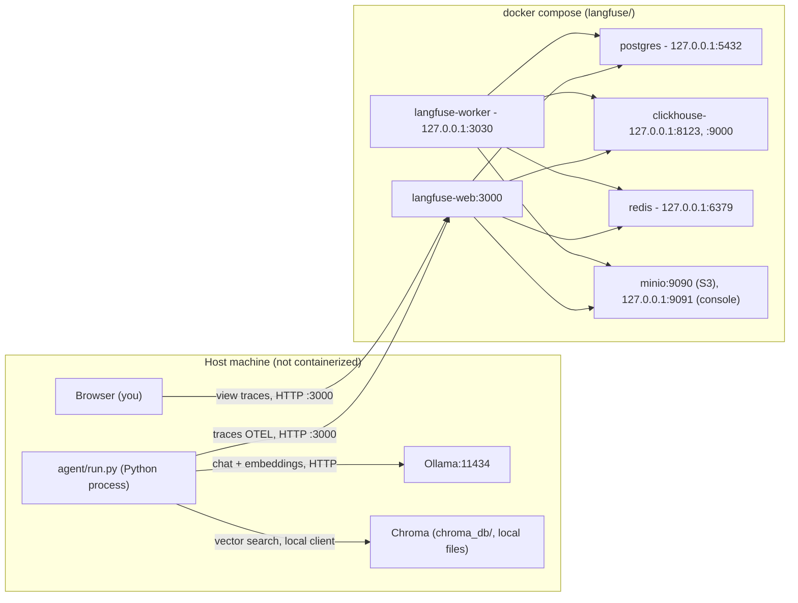

```mermaid
flowchart LR
    subgraph host["Host machine (not containerized)"]
        agent["agent/run.py (Python process)"]
        ollama["Ollama:11434"]
        chroma["Chroma (chroma_db/, local files)"]
        browser["Browser (you)"]
    end

    subgraph compose["docker compose (langfuse/)"]
        web["langfuse-web:3000"]
        worker["langfuse-worker - 127.0.0.1:3030"]
        pg["postgres - 127.0.0.1:5432"]
        ch["clickhouse- 127.0.0.1:8123, :9000"]
        redis["redis - 127.0.0.1:6379"]
        minio["minio:9090 (S3), 127.0.0.1:9091 (console)"]
    end

    agent -->|chat + embeddings, HTTP| ollama
    agent -->|vector search, local client| chroma
    agent -->|traces OTEL, HTTP :3000| web
    browser -->|view traces, HTTP :3000| web

    web --> pg
    web --> ch
    web --> redis
    web --> minio
    worker --> pg
    worker --> ch
    worker --> redis
    worker --> minio
```
